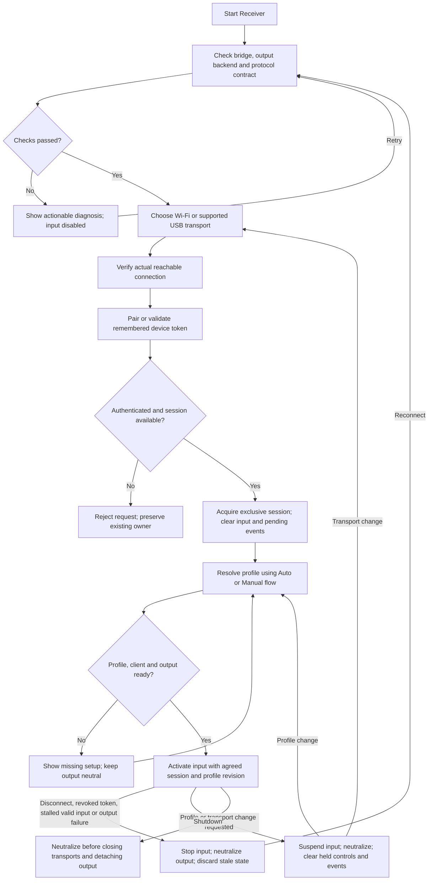
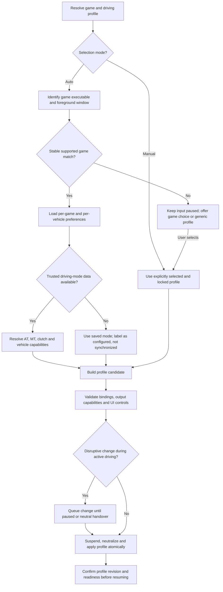
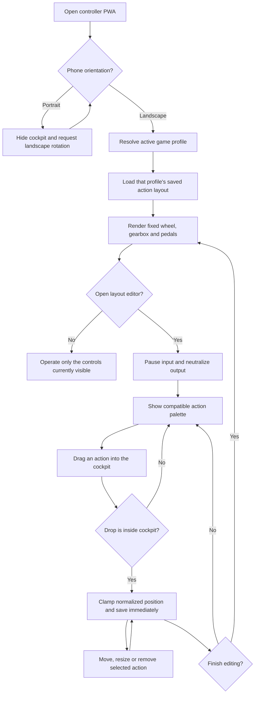

# Architecture

## Current architecture

The runtime keeps the original exact 8-byte v1 state frame and adds two exact 8-byte, sequence-matched extension frames for clutch, handbrake and 64 semantic vehicle actions. Configuration frames are local IPC only. The Gateway and C# bridge both enforce neutralization and one active controller owner.

The LAN Racing Wheel system turns an iPhone into an ultra-low-latency wireless racing wheel and pedal controller for PC games using standard XInput emulation.

```text
iPhone PWA Controller (Safari Mobile)
      │
      │  WebSocket (Binary 8-byte frames @ 60/120 Hz)
      ▼
Node.js LAN Gateway (Express / ws)
      │
      │  Windows Named Pipe (`\\.\pipe\lan_racing_wheel_ipc`)
      ▼
C# Controller Bridge (.NET 9)
      │
      │  IGamepadAdapter (ViGEm Client / Mock)
      ▼
ViGEmBus Virtual Xbox 360 Controller
      │
      ▼
PC Racing Games (Forza Horizon, Assetto Corsa, F1, etc.)
```

## Component Boundaries

1. **iPhone PWA Controller (`apps/controller-web`)**:
   - Zero-dependency Vanilla JS/Canvas client for maximum touch responsiveness.
   - Multi-touch Pointer Events with pointer capture and fail-safe release.
   - Fixed landscape cockpit: the document never scrolls while driving; portrait shows a rotate prompt and settings scroll only inside their overlay.
   - Empty-by-default, per-game action layout. Buttons are created from the edit palette, positioned with normalized coordinates and persisted in `localStorage`.
   - Web Audio synthesizer for crisp tactile audio feedback.
   - 60/120 Hz binary WebSocket sender.
   - Settings & 3-point Calibration stored in `localStorage`.

2. **Node.js Gateway (`apps/gateway`)**:
   - Hosts static PWA assets over HTTP.
   - Manages single-use 120s pairing nonces and device tokens. QR deep links submit the nonce automatically after opening the controller.
   - Enforces single active controller session.
   - Validates frames, unpacks security envelope, and streams 8-byte frames to Named Pipe.

3. **C# Controller Bridge (`apps/bridge`)**:
   - .NET 9 service hosting Named Pipe server.
   - Independent 150ms hardware watchdog that resets virtual controller to neutral on signal loss.
   - `IGamepadAdapter` interface with `ViGEmGamepadAdapter` and `MockGamepadAdapter`.

4. **Windows Receiver Launcher (`apps/receiver`)**:
   - Single executable / CLI coordinator that manages Gateway + Bridge lifecycles.
   - LAN IP discovery and terminal QR code / web status dashboard.

5. **Shared Packages (`packages/`)**:
   - `packages/protocol`: 8-byte binary codec, sequence validation modulo 256.
   - `packages/control-math`: Steering angle normalization, curves, pedal quantization, gear shift latching.

## Implemented architecture and flowcharts

Updated 2026-09-27. These flows describe the implemented control path. Physical phones, USB-tether adapters, virtual drivers and each game/version still require hardware acceptance testing.

### 1. Connection and session lifecycle



- New/reconnected sessions start neutral. Never restore held throttle, clutch, steering or button events from the previous session. Neutral input does not mean sending Park or changing the vehicle's actual gear.
- The desktop Receiver owns fixed TCP port `32178`. Startup may force-close only a listener positively identified as a stale Wheel Receiver; if another application owns the port, startup fails with its name/PID instead of terminating unrelated software.
- Only one controller owns input, including when Wi-Fi and USB are both available. Transport changes release the previous lease before a new session is acquired; a second device cannot silently take over.
- USB tethering is the implemented cable path. Connector shape is irrelevant: USB-A, USB-C and Lightning work only when the cable carries data, the phone enables tethering/Personal Hotspot and Windows exposes a usable RNDIS/NCM/ECM/Apple network adapter. Detecting a physical cable alone is insufficient. Dedicated raw-USB transports need separate platform-specific prototypes.
- A recognized device is not automatically a ready virtual controller. Mock mode must be explicit and must not be reported as game-ready hardware.
- The C# watchdog remains authoritative and must operate independently of Node, UI, game detection and telemetry. Its target is neutral output within 150 ms of the last valid input; invalid/replayed packets do not refresh it. Verify timing under load rather than inferring it from a timer interval.
- During an intentional suspension, force neutral locally before quiescing the sender. Remote suspension/disconnect requests must belong to the active session; other devices cannot reset the owner.

### 2. Game detection and profile selection



- Manual selection overrides automatic detection until the user reenables Auto. Profile selection mode is separate from automatic/manual transmission mode.
- Match executable identity and foreground ownership, not window-title guesses alone. Debounce changes and distinguish launchers from game processes. When multiple games run, expose the selected target.
- Alt-Tab does not immediately select another profile. Suspend keyboard output when the target loses focus; use an explicit focus-loss policy for driving input. Resume with neutral state, never replay queued commands into another application.
- Read game mode from a supported integration or configuration only when it is trustworthy and current. Game recognition alone cannot establish the actual gearbox, selected vehicle or assists.
- Use a profile revision handshake so client controls, receiver mappings and bridge output cannot apply different profiles to the same frame. Profile switches clear old events, including clutch/shift state on MT to AT.
- Do not modify a game's settings just because Wheel detects it. Unavailable controls are hidden or disabled with a reason; compatibility status distinguishes configured, tested and unsupported features.

### 3. Input, output and feedback

```mermaid
flowchart LR
    UI[Vehicle controls and calibrated input] --> Actions[Shared semantic action model]
    Actions --> Analog[Latest analog state only]
    Actions --> Events[Latched button edges and explicit hold or toggle actions]
    Analog --> Send[Session-bound transport]
    Events --> Send
    Send --> Validate[Validate owner, revision, frame, sequence and rate]
    Validate --> Map[Map actions through active game profile]
    Map --> Bridge[C# bridge and authoritative watchdog]
    Bridge --> Output[Selected output adapters without duplicate bindings]
    Output --> Game[Target game]
    Game -. Supported integration .-> Telemetry[Game-confirmed state with freshness checks]
    Telemetry --> Display[Dashboard and control status]
    Map -. Command sent status .-> Display
```



- Preserve a single shared implementation of control math and codec. UI emits actions such as `shiftUp`, `horn` or `headlightMode`; profiles determine gamepad buttons, vJoy axes, keyboard bindings or supported game integration commands.
- Validate exact lengths and supported versions against the agreed contract, use explicit little-endian fields, clamp steering/triggers and neutralize invalid numeric inputs. This design does not override the current 8-byte invariant; extended action transport requires a synchronized specification and invariant update before implementation.
- Keep analog queues bounded and discard superseded samples. Button events need session-local IDs, deduplication and bounded lifetime; acknowledge acceptance at the receiver, without claiming this confirms a game action. Never replay events after reconnection.
- Retain minimum shift pulse duration, release semantics for held controls and exclusive pointer ownership. Differentiate momentary, held, toggle and multi-position controls instead of treating every control as a raw button bit.
- Select supported output backends per profile. Hybrid output must have explicit routing so a single action is not sent twice to a game. Any output holding state must participate in neutralization and shutdown, including keyboard releases.
- Telemetry is a separate, optional return path. Missing/stale telemetry must not refresh the input watchdog, invent RPM/speed, or imply that the game acknowledged a sent command. Label unknown vehicle state and avoid speed-dependent automatic decisions without fresh speed data.

### Vehicle capability groups and UI

| Group | Implemented semantic controls, enabled according to output capability |
| --- | --- |
| Driving | Steering, throttle, brake, clutch, AT selector, sequential/paddles, H-pattern and parking brake |
| Lighting | Position lights, low/high beam, flash-to-pass, front/rear fog lights, left/right indicators, hazards and cabin lights |
| Visibility | Wiper speeds/intermittent mode, washers, rear wiper and mirror controls |
| Power and cabin | Ignition/starter, horn, seat belt, doors, windows, climate and radio |
| Assistance | Cruise/limiter, driving modes, traction/stability controls and supported drivetrain settings |
| Truck/special vehicle | Range/splitter, retarder/engine brake, trailer coupling/brake, differential locks and supported auxiliary systems |
| Game utilities | Camera, looking around, pause and reset, visually separated from vehicle controls |

Keep steering, pedals, gear and frequently used actions on the driving screen. Put extended groups in organized panels and vehicle-specific presets. Layout editing suspends input. Show the detected game, selected profile, Auto/Manual selection, configured transmission, verified connection transport and output readiness without exposing protocol details in normal driving UI.

### 4. Fixed mobile cockpit and saved layout



- Core wheel, transmission and pedal modules stay fixed and are never added or removed by the layout editor.
- Auxiliary actions do not appear by default. Each game profile owns a separate saved list so truck controls do not leak into a racing profile.
- Stored positions are percentages of the cockpit, not device pixels, so a layout survives reloads and different landscape phone widths.
- Editing, opening settings, losing focus, changing orientation or hiding the page pauses control first. Driving resumes only after an explicit **Start** action.
- The editor palette scrolls horizontally; the document itself remains locked. The settings overlay owns its vertical scroll without moving the driving surface.

### Remaining hardware verification order

1. Verify USB tethering on actual Android and iPhone devices; test removal, reconnect and single-owner handover.
2. Verify XInput/vJoy mappings and keyboard bindings in each supported game and driving mode.
3. Add only documented game telemetry integrations, then distinguish commanded state from game-confirmed state.
4. Prototype a dedicated non-tethering USB transport separately if it is still required.

Acceptance must cover the complete path from touch/action through Gateway and C# to observable output, not just successful WebSocket pairing. Include short taps, simultaneous controls, MT to AT, profile revision mismatch, Alt-Tab, multiple games, revoked sessions, malformed frames, backpressure, bridge failure, Wi-Fi loss and cable removal. Record per-game/mode results and actual watchdog timings; these flowcharts do not constitute test evidence.
